# 🤖 Claude Code – Tổng Quan Khóa Học

> Ghi chú đầy đủ về cách làm việc với Claude Code – từ khái niệm cơ bản đến kỹ thuật nâng cao.

---

## 1. Coding Assistant là gì?

Coding Assistant là công cụ sử dụng language model để viết code và hoàn thành các tác vụ phát triển phần mềm.

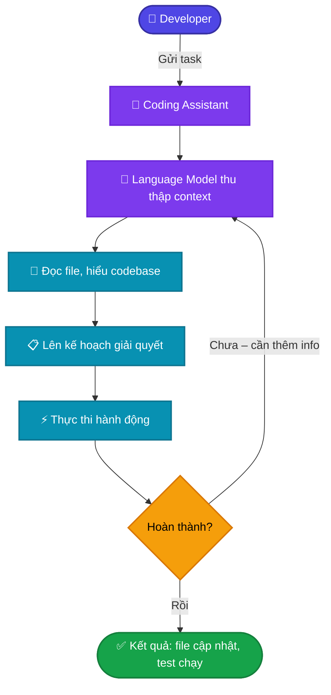

### Hệ thống Tool Use

Language model **chỉ xử lý text** – không thể trực tiếp đọc file hay chạy lệnh. Tool Use là cầu nối:

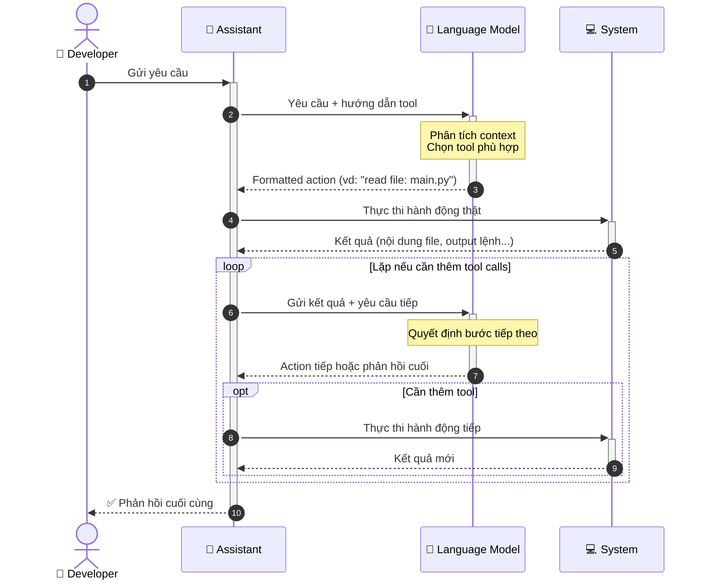

**Ưu điểm của Claude:** Vượt trội về tool use, bảo mật cao hơn (tìm kiếm code trực tiếp, không gửi codebase ra server ngoài).

---

## 2. Claude Code trong thực tế

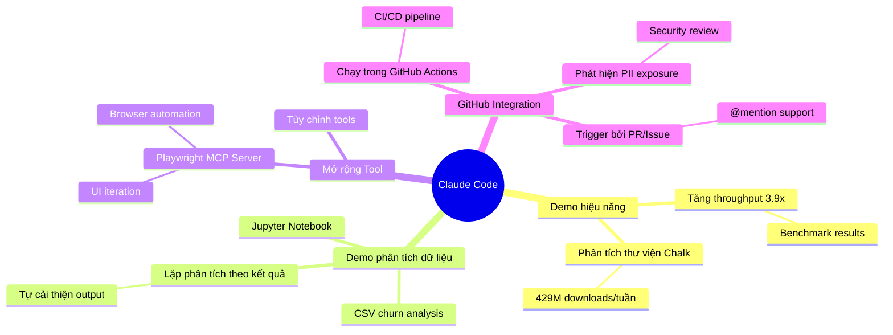

---

## 3. Quản lý Context

> **Nguyên tắc vàng:** Cung cấp vừa đủ thông tin liên quan – quá nhiều context không cần thiết sẽ làm giảm hiệu suất.

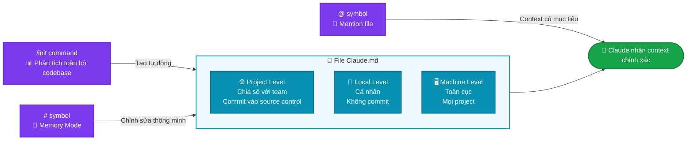

---

## 4. Thực hiện thay đổi

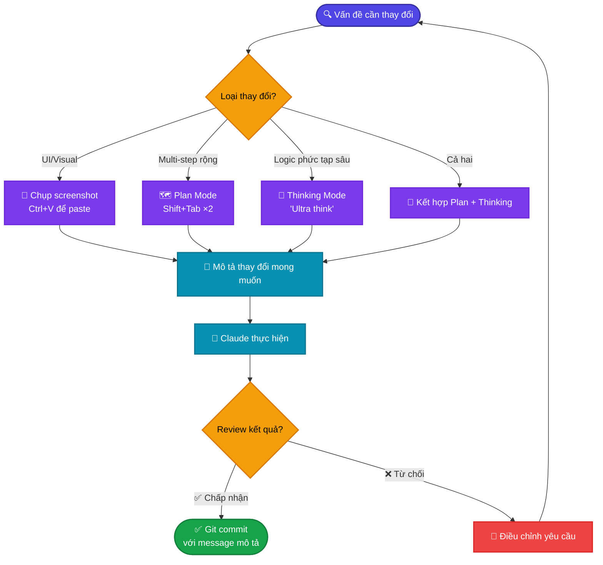

---

## 5. Kiểm soát Context

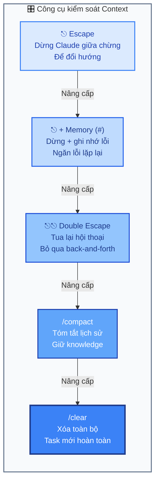

---

## 6. Custom Commands

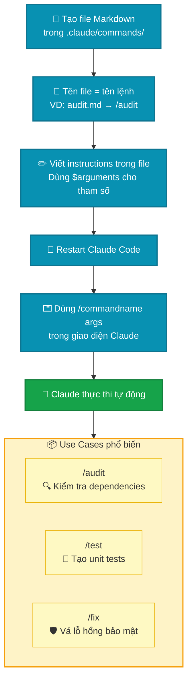

---

## 7. Mở rộng với MCP Servers

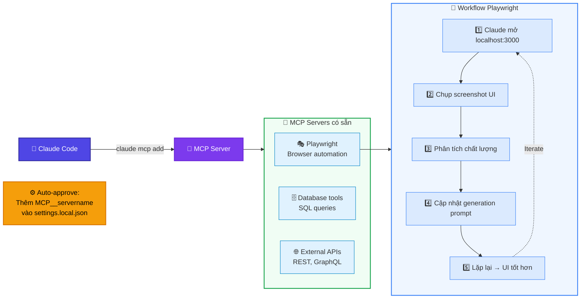

---

## 8. GitHub Integration

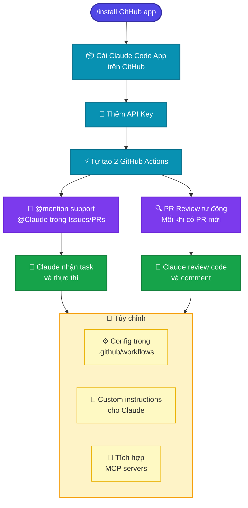

**Ví dụ thực tế:** Claude tự động phát hiện lỗi **PII exposure** trong PR review khi phân tích luồng dữ liệu qua Lambda → S3 → đối tác bên ngoài.

---

## 9. Hooks – Kiểm soát Tool Calls

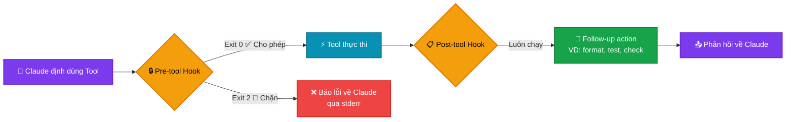

### Cấu trúc Hook trong settings.local.json

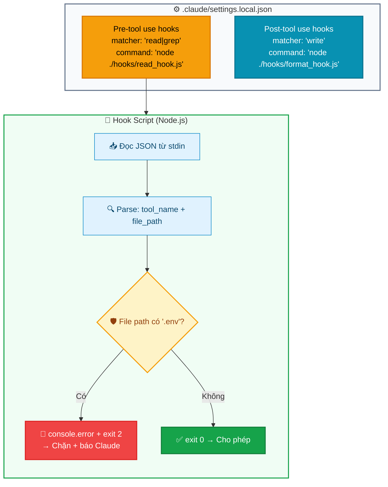

---

## 10. Hooks hữu ích

```mermaid
flowchart TD
    subgraph hook1["🔷 Hook 1: TypeScript Type Checker"]
        A1["✏️ Claude sửa function signature"]:::action --> B1["⚡ Post-tool hook kích hoạt"]:::hook
        B1 --> C1["🔍 Chạy: tsc --no-emit"]:::check
        C1 -->|Có lỗi type| D1["📤 Feed lỗi về Claude"]:::error
        D1 --> E1["✅ Claude tự sửa call sites"]:::success
        C1 -->|Không lỗi| F1["✅ Tiếp tục bình thường"]:::success
    end

    subgraph hook2["🔷 Hook 2: Duplicate Code Prevention"]
        A2["📄 Claude tạo file mới<br/>trong queries/"]:::action --> B2["⚡ Post-tool hook kích hoạt"]:::hook
        B2 --> C2["🤖 Launch Claude instance thứ 2<br/>qua TypeScript SDK"]:::check
        C2 --> D2["🔍 So sánh code mới vs code cũ"]:::check
        D2 -->|Duplicate| E2["🚫 Exit 2 + feedback<br/>→ Claude reuse code cũ"]:::error
        D2 -->|Unique| F2["✅ Exit 0 → Cho phép"]:::success
    end

    classDef action fill:#0891b2,color:#fff,stroke:#0e7490,stroke-width:2px
    classDef hook fill:#f59e0b,color:#000,stroke:#d97706,stroke-width:2px
    classDef check fill:#7c3aed,color:#fff,stroke:#6d28d9,stroke-width:2px
    classDef error fill:#ef4444,color:#fff,stroke:#dc2626,stroke-width:2px
    classDef success fill:#16a34a,color:#fff,stroke:#15803d,stroke-width:2px

    style hook1 fill:#eff6ff,stroke:#3b82f6,stroke-width:2px
    style hook2 fill:#eff6ff,stroke:#3b82f6,stroke-width:2px
```

---

## 11. Claude Code SDK

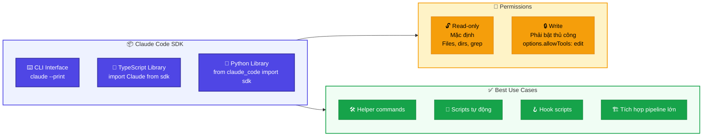

---

## 📊 Tổng quan kiến trúc Claude Code

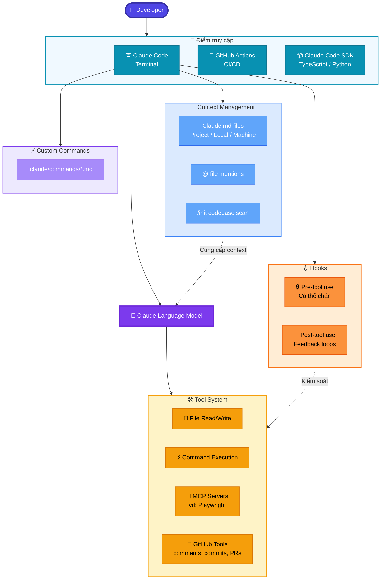

---

## 📝 Bảng tóm tắt nhanh

| Tính năng | Shortcut / Lệnh | Mục đích |
|---|---|---|
| Memory Mode | `#` | Chỉnh sửa Claude.md thông minh |
| File mention | `@filename` | Thêm context cụ thể |
| Plan Mode | `Shift+Tab ×2` | Nghiên cứu & lên kế hoạch rộng |
| Thinking Mode | `"Ultra think"` | Lý luận sâu cho logic phức tạp |
| Paste screenshot | `Ctrl+V` | Mô tả UI element |
| Dừng Claude | `Escape` | Đổi hướng giữa chừng |
| Tua lại | `Escape ×2` | Nhảy về điểm trước trong hội thoại |
| Tóm tắt hội thoại | `/compact` | Giữ knowledge, dọn clutter |
| Xóa hội thoại | `/clear` | Bắt đầu task mới |
| Khởi tạo project | `/init` | Tạo Claude.md từ codebase |
| Cài MCP server | `claude mcp add` | Mở rộng khả năng Claude |
| Cài GitHub App | `/install GitHub app` | Tích hợp CI/CD |

---

*📅 Cập nhật: 2026-03-28*